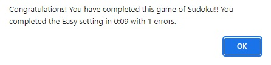

# Sudoku - A Game Made with HTML, CSS & JavaScript.

# Introduction
Sudoku is a well known and popular puzzle game where a user is challenged correctly ascertain combinatorial number placement. Whilst all Sudoku games are based on the same principles, there are many different versions where different features are available to the user. A basic version would typically supply the board in which to solve the puzzle whereas this version is more advanced and aims to provide the user with many features such as ability to track time taken to solve the puzzle, pause the game, undo or redo actions taken, use notes to aid the completion of the puzzle, choose to hear music whilst they play and auto-solve the puzzle should the user wish. To add additional challenge the user can change the difficulty, and the number of errors made is recorded during a game encouraging replayability so as to beat their previous score. When the game is complete the user is either congratulated and shown the difficulty setting chosen, the time taken and the number of errors made. If the game not been completed correctly then the user is presented with a commiseration message.

[Live Website Here](https://tonywilson1211.github.io/P2_Sudoku/)

# README Contents

* [Introduction](#introduction)
* [User Experience (UX)](#user-experience)
    * [User stories](#user-stories)
* [Design](#design)
    * [Initial Design - Wireframe](#initial-concept---wire-frames)
    * [Website Structure](#website-structure)
    * [Colour Scheme](#colour-scheme)
    * [Typography](#typography)
    * [Imagery](#imagery)
    * [Interactive Links](#interactive-links) 
* [Existing Features](#existing-features)
    * [Landing Page](#landing-page)
    * [Navigation Bar](#navigation-bar)
    * [About Section](#about-section)
    * [Services Section](#services-section)
    * [Gallery Section](#gallery-section)
    * [Contact Us Section](#contact-us-section)
    * [Favicon](#favicon)
    * [Thank You Page](#thank-you-page)
    * [Footer Section](#footer-section)
    * [404 Error](#404-page)
* [Future Features](#future-features)
* [Technologies Used](#technologies-used)
* [Testing](#testing)
    * [Responsiveness](#responsiveness)
    * [Validators](#validators)
    * [Lighthouse](#lighthouse)
    * [Functional Testing](#functional-testing)
    * [Bugs](#bugs)
    * [Website Development Issues](#website-development-issues)
* [Deployment](#deployment-this-project)
    * [Deployment This Project](#deployment-this-project)
    * [Forking This Project](#forking-this-project)
    * [Cloning This Project](#cloning-this-project)
* [Credits](#credits)
* [Content](#content)

## User Experience

### User Requirements

Some example user stories which have affected the design:

* As a person who enjoys Sudoku, I want to get straight into playing the game. I have played other versions and find them a little aesthetically dull and lack features.

* As a person who hasn't played before, I would like to read the rules of the game. I want to know exactly how to play and what to expect

* As a person that likes a challenge, I would like the option of a more difficult game

## Design

### Initial Concept - Wireframes
* The majority of the initial design was followed with only a few alternations made such as giving the digit selection buttons and note mode buttons a different coloured background when selected.
 
 
 

### Website Structure
* Sudoku website consists of 2 main pages: Home Page and Game Page.
* One additional page exists, a 404 Error Page.
* The Home Page has 4 sections: (1) Title and Game Start button, (2) Rules, (3) image highlting features and the function, (4) buttons to Start Game and Home (returns to top of page). 
* The Game Page is broken down into sections for different button placement surrounding the center puzzle board.
* Home Page and Game Page are accessible to each other. 404 page is accessed should the url not be recognised.

### Colour Scheme
* There are three main colours used throughout the website: (1) dark red (#721200), (2) beige (#d8cdb7), (3) dark beige (#bdb29f). 4 supplementary colours used to provide contrast are: (1)'white', (2)'green' and (3)'skyblue' and (4)'black'. 
* All colours were picked to either compliment or work in contrast to the background image which was found via Google Images. (royalty free)
* The background image provides a light wood effect which acts as a more interesting background than a block colour, but also serves to not be too distracting either.  

### Typography
* The Permenant Marker font is used for the main logo and headings. Chosen for being bold, playful and hard to miss.
* The Lustria font is used everywhere else as is easy to read but also offers a playful look to the numbering on the Sudoku board without being distracting or hard to read. 

### Imagery

* There are only two images used on this site. The first is the wood background on all pages and was sourced from Google Images. The second is a screenshot of the game itself to act as a tool to assist users on how to use functions within the game. Microsoft paint was used to add text and arrows. 

* Both images have been converted to webp format using
[cloudconvert](https://cloudconvert.com/).

## Existing Features

1. The index page is the page containing details on how to play and has a link at both the top and bottom of the page taking the user to the game. 

        "As a person who enjoys Sudoku, I want to get straight into playing the game."

* The game is available to play with default settings on the game page. A user is able to play as soon as they click on the 'Start Game' button.

    * Start Game Button immdiately seen on index page 
    

---

2. Details of how to play and features available is available to be seen straight away.

        "As a person who hasn't played before I want to know exactly how to play and what to expect."

* The user is able to immediately see when loading the site the rules are available and present in a format that is quick and easy to understand.
* An image of the game is displayed with annotations explaining each function available. 

    * How To Play  
     
    * Functions 
    

---

3. There is a way to change the difficulty, making it more of a challenge.

        "As a person that likes a challenge I would like the option of a more difficult game"

* The user is able to change the difficulty setting to add additional challenge if desired. 
* At the end of the game, if completed correctly, the game will present the user with confirmation of the difficulty level they have completed, the time is has taken and the number of errors made. This allows the user to make a note of this information and 
  replay the same level with the intension of improving their score.
* There is an option to use notes during the game to aid the user when filling in the correct answers. This is an optional feature which the user does not have to utilise should they wish to increase the challenge. 

    * Congratulations Message 
    

---

4. There are different features available to the user.

        "As a person who has played Sudoku before, I want more functions available whilst i play the game."

* Timer: A stopwatch informs the user how much time has passed during their game. The timer begins when the page is loaded and can be paused at anytime. It is reset when a new game begins.
* Undo/Redo: An undo button removes any numbers the user has entered into the board in the reverse order they were entered. The Redo button can then re-enter any numbers that had been removed with the undo button. This does not apply to notes by design.
* Notes: Notes can be entered into each tile on the board in order to help the user narrow down the possible solutions to each tile. If the wrong number is entered into a tile but is in notes form, it is not counted as an error.
* Auto-Solve: Should the user desire to end the game but see the correct solution for the puzzle, they can click on 'auto-solve'
* Music: Music is available to be played to add ambiance. 

---

5. Click controls

        "...click rather than drag and drop..."

* The interface of the application allows users to single tap or click, rather than relying on a drag effect, to make their selections.

---

6. A clean and attractive design.

        "...it would be nice to see a little more style..."

* The design considerations ensure an attractive application that is more appealing than other versions I found while researching. The photographed wood effect means the game board looks authentic.

  

---

7. User error preventative JavaScript.

"...I don't want to get an error if i accidentially enter the same number more than once..."

* The JavaScript is written in a way that prevents users from accidentally entering the same number more than once.

---

## Features Left to Implement

1. Upon starting a new game the board automatically generates a new puzzle layout rather than utilising a predetermind arrangement of numbers. 
2. More options for music tracks so users can control what songs are played.
3. Option for user to switch between light and dark mode.

## Technologies Used

* [Instant Eyedropper](http://instant-eyedropper.com/)
  - A quick and simple application to obtain hex values from any colour on my
  display. I downloaded this while playing around with my laptop layout/display
  settings. I have the app set to run on startup and remain minimized in my
  system tray. This allows quick access and if I click the colour, it
  automatically copies the value to my clipboard.
* [Google Lighthouse](https://developer.chrome.com/docs/lighthouse/overview/)
  - Google Lighthouse was used to test Performance, Best Practices, Accessibility and SEO.
* [Windows Snipping Tool](https://support.microsoft.com/en-us/windows/use-snipping-tool-to-capture-screenshots-00246869-1843-655f-f220-97299b865f6b)
  - A screenshot tool built in to Windows. It allows quick, partial screenshots
  to be taken that can be saved as image files.
* [Paint3D](https://www.microsoft.com/en-gb/p/paint-3d/9nblggh5fv99?activetab=pivot:overviewtab)
  - Free software on Windows, allowing image editing and creation.
* [JSHint](https://jshint.com/)
  - A static code analysis tool for JavaScript. [Results here](#jshint).

  
- *[Balsamiq](https://balsamiq.com/)*
  - Balsamiq was used to create [wireframes](./readme-content/wireframes.md)
  for the project.
- *[CloudConvert](https://cloudconvert.com/)*
  - All images within the project have been processed through their free file
  converter service
- *[Font Awesome](https://fontawesome.com/)*
  - The project uses icons from Font Awesome version 5.
- *[Coolors.co](https://coolors.co)*
  - The colour scheme, and subsequent shades and tones, were generated via this
  application.
- *[Chrome DevTools](https://developer.chrome.com/docs/devtools/)*
  - Once the website was made to a basic deployment level, this extension
  featured heavily as I modified sizings and spacings.
- *[Google Fonts](https://fonts.google.com/)*
  - The fonts used in the website are imported from Google Fonts.
- *[Favicon Converter](https://favicon.io/favicon-converter/)*
  - A service to convert images to favicons
- *[Multi Device Mockup Generator](https://techsini.com/multi-mockup/index.php)*
  - The image at the top of this document was created using a free service
  provided by TechSini.&#8203;com
- *[WebAIM Contrast Checker](https://webaim.org/resources/contrastchecker/)*
  - A contrast checker to test WCAG levels.
- *[Wave Web Accessibility Evaluation Tool](https://wave.webaim.org/)*
  - A tool to check for errors with accessibility. [Results here](#wave).
- *[W3C Markup Validation Service](validator.w3.org)*
  - A service to check the HTML and CSS files for errors. During
  development, I copied the entire text from the files and ran them through the
  direct input method. Upon completion, I ran the deployed site through the
  'Validate by URI' method with [results here](#w3c-validator).
- *[Visual Studio Code](https://code.visualstudio.com/)*
  - A free, streamlined code editor. The [extensions](#vscode-extensions)
  available have allowed me to customize my workspace and become more
  efficient.