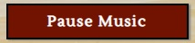

# Sudoku - A Game Made with HTML, CSS & JavaScript.

# Introduction
Sudoku is a well known and popular puzzle game where a user is challenged correctly ascertain combinatorial number placement. Whilst all Sudoku games are based on the same principles, there are many different versions where different features are available to the user. A basic version would typically supply the board in which to solve the puzzle whereas this version is more advanced and aims to provide the user with many features such as ability to track time taken to solve the puzzle, pause the game, undo or redo actions taken, use notes to aid the completion of the puzzle, choose to hear music whilst they play and auto-solve the puzzle should the user wish. To add additional challenge the user can change the difficulty, and the number of errors made is recorded during a game encouraging replayability so as to beat their previous score. When the game is complete the user is either congratulated and shown the difficulty setting chosen, the time taken and the number of errors made. If the game not been completed correctly then the user is presented with a commiseration message.

[Live Website Here](https://tonywilson1211.github.io/P2_Sudoku/)

# README Contents

* [Introduction](#introduction)
* [User Experience (UX)](#user-experience)
    * [User stories](#user-stories)
* [Design](#design)
    * [Initial Design - Wireframe](#initial-concept---wire-frames)
    * [Website Structure](#website-structure)
    * [Colour Scheme](#colour-scheme)
    * [Typography](#typography)
    * [Imagery](#imagery)
* [Existing Features](#existing-features)
    * [Simple and Fast Navigation](#simple-and-fast-navigation)
    * [How To Play Guide](#how-to-play-guide)
    * [Change Difficulty](#Change-Difficulty)
    * [User Functionality](#user-functionality)
    * [Click Controls](#click-controls)
    * [Intuitive and Attractive Layout](#intuitive-and-attractive-layout)
    * [User Error Preventative JavaScript](#user-error-preventative-javascript)
    * [Feedback From Website to User](#feedback-from-website-to-user)
    * [404 Error](#404-page)
* [Future Features](#future-features)
* [Technologies Used](#technologies-used)
* [Testing](#testing)
    * [Responsiveness](#responsiveness)
    * [Validators](#validators)
    * [Lighthouse](#lighthouse)
    * [Functional Testing](#functional-testing)
    * [Bugs](#bugs)
    * [Website Development Issues](#website-development-issues)
* [Deployment](#deployment-this-project)
    * [Deployment This Project](#deployment-this-project)
    * [Forking This Project](#forking-this-project)
    * [Cloning This Project](#cloning-this-project)
* [Credits](#credits)
* [Content](#content)

## User Experience

### User Requirements

Some example user stories which have affected the design:

* As a person who enjoys Sudoku, I want to get straight into playing the game. I have played other versions and find them a little aesthetically dull and lack features.

* As a person who hasn't played before, I would like to read the rules of the game. I want to know exactly how to play and what to expect

* As a person that likes a challenge, I would like the option of a more difficult game

## Design

### Initial Concept - Wireframes
* The majority of the initial design was followed with only a few alternations made such as giving the digit selection buttons and note mode buttons a different coloured background when selected.
 
 
 

### Website Structure
* Sudoku website consists of 2 main pages: Home Page and Game Page.
* One additional page exists, a 404 Error Page.
* The Home Page has 4 sections: (1) Title and Game Start button, (2) Rules, (3) image highlting features and the function, (4) buttons to Start Game and Home (returns to top of page). 
* The Game Page is broken down into sections for different button placement surrounding the center puzzle board.
* Home Page and Game Page are accessible to each other. 404 page is accessed should the url not be recognised.

### Colour Scheme
* There are three main colours used throughout the website: (1) dark red (#721200), (2) beige (#d8cdb7), (3) dark beige (#bdb29f). 4 supplementary colours used to provide contrast are: (1)'white', (2)'green' and (3)'skyblue' and (4)'black'. 
* All colours were picked to either compliment or work in contrast to the background image which was found via Google Images. (royalty free)
* The background image provides a light wood effect which acts as a more interesting background than a block colour, but also serves to not be too distracting either.  

### Typography
* The Permenant Marker font is used for the main logo and headings. Chosen for being bold, playful and hard to miss.
* The Lustria font is used everywhere else as is easy to read but also offers a playful look to the numbering on the Sudoku board without being distracting or hard to read. 

### Imagery

* There are only two images used on this site. The first is the wood background on all pages and was sourced from Google Images. The second is a screenshot of the game itself to act as a tool to assist users on how to use functions within the game. Microsoft paint was used to add text and arrows. 

* Both images have been converted to webp format using
[cloudconvert](https://cloudconvert.com/).

## Existing Features

### Simple and Fast Navigation 

        "As a person who enjoys Sudoku, I want to get straight into playing the game."

* The index page is the page containing details on how to play and has a link at both the top and bottom of the page taking the user to the game.
* The game is available to play with default settings on the game page. A user is able to play as soon as they click on the 'Start Game' button.

    * Start Game Button immdiately available on the index page 
    

### How To Play Guide 

        "As a person who hasn't played before I want to know exactly how to play and what to expect."

* Details of how to play and features available is available to be seen straight away.
* The user is able to immediately see when loading the site the rules are available and present in a format that is quick and easy to understand.
* An image of the game is displayed with annotations explaining each function available. 

    * How To Play  
     
    * Functions 
    

### Change Difficulty

        "As a person that likes a challenge I would like the option of a more difficult game"

* 3 difficulty options are available to the user: Easy, Medium, Hard. 
* The user is able to change the difficulty at any point 
* The button to change difficulty is placed next to the board so as to be easily found. 
* At the end of the game, if completed correctly, the game will present the user with confirmation of the difficulty level they have completed, the time is has taken and the number of errors made. This allows the user to make a note of this information and 
  replay the same level with the intension of improving their score.
* There is an option to use notes during the game to aid the user when filling in the correct answers. This is an optional feature which the user does not have to utilise should they wish to increase the challenge. 

    * Congratulations Message 
    

    * Commiserations Message 
    

### User Functionality 

        "As a person who has played Sudoku before, I want more functions available whilst i play the game."

* There are multiple different functions and features available to the user.

1. Timer
    * A stopwatch informs the user how much time has passed during their game. The timer begins when the page is loaded and can be paused at anytime. It is reset when a new game begins. 
    * When clicked, the timer will pause and the icon will change.
    * The timer serves to inform the user the amount that it has taken in order to complete the puzzle. This time becomes a target for the user to beat next time they play.

    
    

2. Undo/Redo

    * An Undo button removes any numbers the user has entered into the board in the reverse order they were entered. 
    * The Redo button can then re-enter any numbers that had been removed with the undo button. This does not apply to notes by design.
    * The buttons have been added to provide a good user experience by making adjustments to the board quick and easy. 

    
    

3. Notes 
    * Notes can be entered into each tile on the board in order to help the user narrow down the possible solutions to each tile. 
    * When notes mode is active, the notes icon has a skyblue background.
    * If the wrong number is entered into a tile but is in notes form, it is not counted as an error. 

    

4. Auto-Solve 
    * Should the user desire to end the game but see the correct solution for the puzzle, they can click on 'auto-solve' 

    

5. Music 
    * Music is available to be played to add ambiance. 
    * When music is not playing, the button says 'Play Music'
    * When music is playing, the button says 'Pause Music'

    
    

### Click Controls

        "...click rather than drag and drop..."

* The interface of the application allows users to single tap or click, rather than relying on a drag effect, to make their selections.

### Intuitive and Attractive Layout

        "...it would be nice to see a little more style..."

* The design considerations ensure an attractive application that is more appealing than other versions I found while researching. The photographed wood effect means the game board looks authentic.
* The button layout and placement are easily identifable.

  

### User Error Preventative JavaScript

    "...I don't want to get an error if i accidentially enter the same number more than once..."

* The JavaScript is written in a way that prevents users from accidentally entering the same number more than once.

### Feedback From Website to User

    "...I don't want to be confused or unsure how to interact with the game at any point..."

* A large range of feedback messages to the user are prompted during various precise moments.

#### Game Paused

* A message will tell the user the game is paused and that they will not be able to interact with the board. 

* When the game is unpaused a confirmation message will appear. 

#### Game restart

* During a game, if the user attempts to (1) change difficulty (2) restart the game (3) click on 'How To Play' button, the user is greeted with warning message and questioned on whether to proceed.
* If the user clicks on cancel then they abort the action and return to the game. 

* Change Difficulty Message 

* Restart Game Message 

* About to Leave Page Message 

#### Undo/Redo

* If the user clicks the undo or redo buttons but there is nothing to be undone or redone, the user will be greated with the correspondaning message.

#### Auto Solve

* If the user wishes to auto-solve the puzzle they will be greeted with a message asking if they are sure. If they proceed then a follow up message of commiseration and encouragement is presented.
* If the user clicks on cancel then they abort the action and return to the game. 

### 404 Error Page

* A 404 error page will be displayed should a broken link be used when navigating the website.
* A link returning to the home button is immediately obvious allowing for improved UX

## Features Left to Implement

1. Upon starting a new game the board automatically generates a new puzzle layout rather than utilising a predetermind arrangement of numbers. 
2. More options for music tracks so users can control what songs are played.
3. Option for user to switch between light and dark mode.

## Technologies Used

* [Instant Eyedropper](http://instant-eyedropper.com/)
  - A quick and simple application to obtain hex values from any colour on my
  display. I downloaded this while playing around with my laptop layout/display
  settings. I have the app set to run on startup and remain minimized in my
  system tray. This allows quick access and if I click the colour, it
  automatically copies the value to my clipboard.
* [Google Lighthouse](https://developer.chrome.com/docs/lighthouse/overview/)
  - Google Lighthouse was used to test Performance, Best Practices, Accessibility and SEO.
* [Windows Snipping Tool](https://support.microsoft.com/en-us/windows/use-snipping-tool-to-capture-screenshots-00246869-1843-655f-f220-97299b865f6b)
  - A screenshot tool built in to Windows. It allows quick, partial screenshots
  to be taken that can be saved as image files.
* [Paint3D](https://www.microsoft.com/en-gb/p/paint-3d/9nblggh5fv99?activetab=pivot:overviewtab)
  - Free software on Windows, allowing image editing and creation.
* [JSHint](https://jshint.com/)
  - A static code analysis tool for JavaScript. [Results here](#jshint).
* [CloudConvert](https://cloudconvert.com/)
  - All images within the project have been processed through their free file
  converter service
* [Font Awesome](https://fontawesome.com/)
  - The project uses icons from Font Awesome version 5.
* [Chrome DevTools](https://developer.chrome.com/docs/devtools/)
  - Once the website was made to a basic deployment level, this extension
  featured heavily as I modified sizings and spacings.
* [Google Fonts](https://fonts.google.com/)
  - The fonts used in the website are imported from Google Fonts.
* [Favicon Converter](https://favicon.io/favicon-converter/)
  - A service to convert images to favicons
* [Multi Device Mockup Generator](https://techsini.com/multi-mockup/index.php)
  - The image at the top of this document was created using a free service
  provided by TechSini.
* [Wave Web Accessibility Evaluation Tool](https://wave.webaim.org/)
  - A tool to check for errors with accessibility. [Results here](#wave).
* [W3C Markup Validation Service](validator.w3.org)
  - A service to check the HTML and CSS files for errors. During
  development, I copied the entire text from the files and ran them through the
  direct input method. Upon completion, I ran the deployed site through the
  'Validate by URI' method with [results here](#w3c-validator).
- *[Visual Studio Code](https://code.visualstudio.com/)*
  - A free, streamlined code editor. The [extensions](#vscode-extensions)
  available have allowed me to customize my workspace and become more
  efficient.

## Testing

### Responsiveness
* All pages were tested to ensure responsiveness on screen sizes from 320px upwards, as defined in WCAG 2.1 Reflow criteria for responsive design on Chrome, Edge, Firefox and Opera browsers.
* Devices tested using the Google Developer Tools emulator

    * Apple iPhone 4 (320px x 480px)
    * Nokia Lumia 520 (320px x 533px) 
    * Apple iPhone 5/S (320px 568px)
    * Samsung Galaxy S9+(320px x 658px) 
    * Google Pixel 4 (353px x 745px)
    * BlackBerry Z30 (360px x 640px)  
    * Samsung Galaxy S3 (360px x 640px)
    * Microsoft Lumia 950 (360px x 640px) 
    * Samsung Galaxy S8 (360px x 740px) 
    * Apple iPhone 6/7/8 (375px x 667px)
    * Apple iPhone X (375px x 812px)
    * LG Optimus L70 (384px x 640px)
    * Nexus 4 (384px x 640px) 
    * Apple iPhone 12 Pro (390px x 844px)
    * Pixel 3 (393px x 786px)
    * Google Pixel 5 (393px x 851px)
    * Google Pixel 2 (411px x 731px)
    * Nexus 5X (412px x 732px)
    * Samsung Galaxy S20 Ultra (412px x 915px)
    * Apple iPhone 6/7/8 Plus (414px x 736px)
    * Apple iPhone XR (414px x 896px)
    * Apple iPad Mini (468px x 4024)
    * Nokia N9 (480px x 854px)
    * Surface Duo (540px x 720px)
    * Nexus 7 (600px x 960px)
    * BlackBerry PlayBook (600px x 1024px) 
    * Microsoft Lumia 550 (640px x 360px) 
    * Samsung Galaxy Tab S4 (712px x 1138px)
    * Apple iPad Mini (768px x 1024px)
    * Kindle Fire HDX (800px x 1280px)
    * Apple iPad Air (820px x 1180px)
    * Surface Pro 7 (912px x 1368px)
    * Nest Hub (1024px x 600px)
    * Apple iPad Pro (1024px x 1366px)
    * Nest Hub Max (1280px x 800px)

    

* The website is responsiveness down to a width of 300px. This means two devices were identified during testing as not being compatible (1) Galaxy Fold (280px x 653px)  (2) JioPhone 2 (240px x 320px). 
* This will be resolved in future updates.

### Validators

* The W3C Markup Validator, W3C CSS Validator Services and JSHint were used to validate code within the project.

* [W3C Markup Validator](https://validator.w3.org/#validate_by_input) 
* No errors were found with HTML code in final testing.
    * Index Page Results 
    * 
    * Game Page Results 
    * 
    * Error 404 Page Results 
    * 

* [W3C CSS Validator](https://jigsaw.w3.org/css-validator/#validate_by_input) 
* No errors were found with CSS code in final testing.
    * 

* [JSHint](https://jshint.com/)
* No errors were found with JS code in final testing.
* The cyclometric complexity peaks at 6 which is higher than desired. This is down to only one function within the code called Function tileClick. Due to the nature of the puzzle and the amount of logic that is applied to each tile within the game board, the complexity is not easily avoided. As a result I have opted for making the code easy to read and maintainable rather than focusing on reducing the cyclometric complexity rating.
 
    * 

### Lighthouse
Google Lighthouse was used to test Performance, Best Practices, Accessibility and SEO.
* Website results
    * 
    * 
    * 
    * 

### Functional Testing 
* All links have been hovered and clicked to ensure accessibility, and all are working correctly.
* All images have alt attributes
* All links have ariel-labels
* Pages all load correctly on all device screen sizes.
* All social media links work correctly and open on a new tab.
* All images load on each page as intended.
* All navigation links are working correctly and bring the users to the function intended.
* The form on the contact us page was tested to ensure it functioned as expected. Data is required within all sections of the form or submition isn't possible. Thank you page was displayed as expected once the form had been filled out correctly and submitted.
